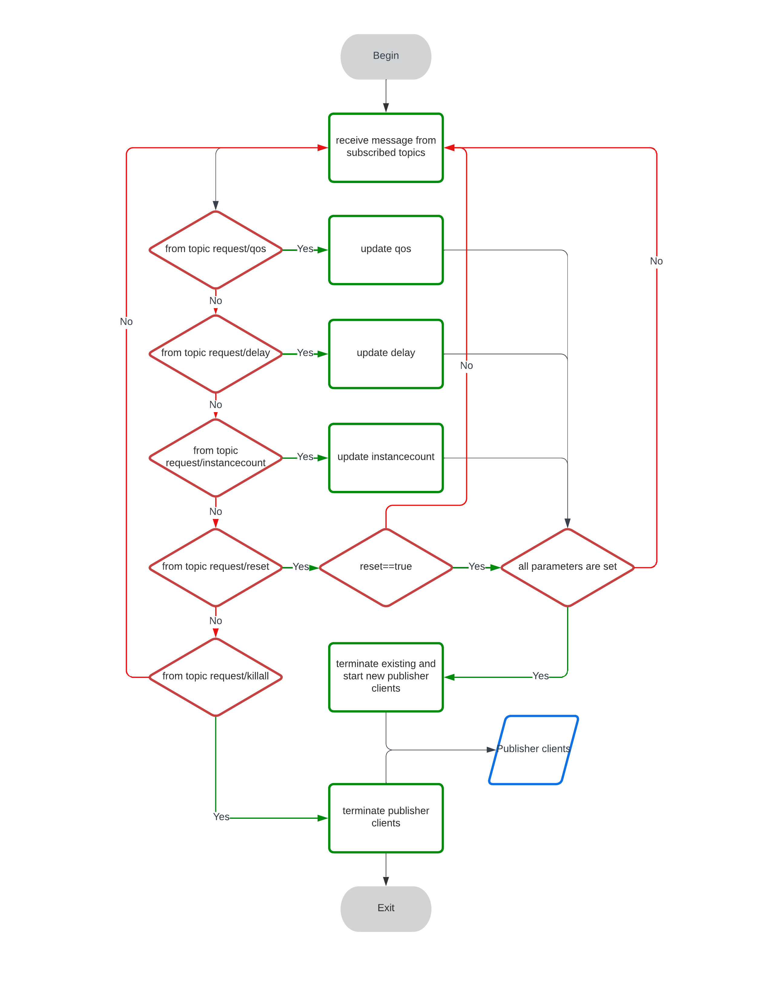
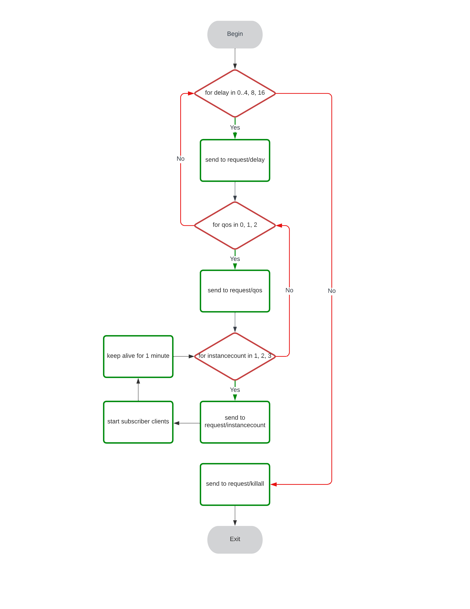

## Controller and Analyser Usage
---
Start the Controller first before starting the Analyser

<dl>
    <dt>Configuring the controller</dt>
    <dd><code>./controller.exe -t=&lt;host uri&gt;</code></dd>
</dl>

<dl>
    <dt>Configuring the analyser</dt>
    <dd><code>./analyser.exe -t=&lt;host uri&gt; -d=&lt;starting delay level&gt; -D=&lt;ending delay level&gt; -i=&lt;instance count&gt; -m=&lt;measuring time&gt; -r=&lt;buffering duration after each runtime iteration reset&gt;</code></dd>
</dl>

<dl>
    <dt>Logging</dt>
    <dd>The log files for both controller and analyser will be stored in the same directory under folder <i>./Logs</i>, the controller log file will have a name of <i>&lt;date_time&gt;-C.log</i>, and the analyser log file will have a name of <i>&lt;date_time&gt;-A.log</i>. All runtime statistics will be recorded in the log file.</dd>
</dl>

 

## MQTT QoS explained
---
<dl>
    <dt>QoS 0</dt>
    <dd>At QoS=0, the message will only be sent once, the sender will not look for an acknowledgement from the receiver. Thus there is no guarantee that the message will be delivered.</dd>
    <dt>QoS 1</dt>
    <dd>At QoS=1, the message will be sent countless times until an acknowledgement is returned from the receiver. This guarantees that the message will be delivered, however duplicate messages could be sent in the process.</dd>
    <dt>QoS 2</dt>
    <dd>At QoS=2, the delivery of the message will be ensured by a two-way four-part handshake process, to achieve the highest level of message integrity and reliability. This is the most time consuming since both parties will be exchanging the acknowledgement messages, until mutual confirmation of the delivery of the message.</dd>
</dl>

 

## Controller workflow
---

 

## Analyser workflow
---
